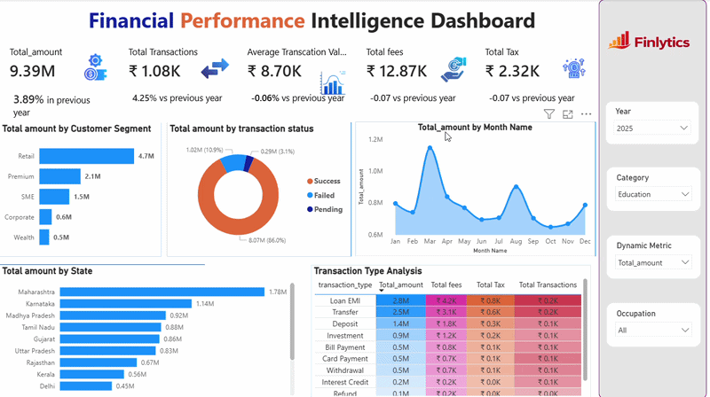

# 📊 Financial Performance Intelligence Dashboard


<p align="center">
  
</p>

<p align="center">


</p>

---

# 📌 Project Overview

The Financial Performance Intelligence Dashboard is a comprehensive Business Intelligence solution developed using Power BI to monitor, analyze, and optimize financial transaction performance across customer segments, transaction categories, and geographic regions.

The dashboard transforms raw transactional data into actionable insights, enabling stakeholders to evaluate financial performance, track operational efficiency, analyze customer behavior, and support data-driven decision-making.

This project demonstrates end-to-end analytics capabilities including data modeling, KPI development, interactive dashboard design, business analysis, and performance reporting.

---

# 🎯 Business Problem

Financial institutions process thousands of transactions across various customer segments, states, and transaction categories.

Without a centralized reporting system, stakeholders face challenges in:

* Monitoring overall financial performance
* Tracking transaction growth trends
* Identifying high-performing customer segments
* Measuring transaction success rates
* Understanding state-wise financial performance
* Evaluating transaction profitability
* Tracking fee and tax generation
* Comparing year-over-year business performance

A centralized analytics solution was required to provide real-time visibility into business performance and support strategic decision-making.

---

# 💡 Solution

The Financial Performance Intelligence Dashboard provides an interactive analytical platform that enables business users to:

* Monitor financial KPIs in real time
* Analyze monthly transaction trends
* Evaluate transaction success rates
* Identify top-performing customer segments
* Compare regional performance
* Measure operational fees and taxes
* Analyze transaction type profitability
* Understand customer demographics
* Track year-over-year growth

---

# 🏗 Data Architecture

The solution follows a dimensional modeling approach optimized for analytical reporting and dashboard performance.

## Fact Table

### Fact_Transactions

Contains transactional measures including:

* Transaction Amount
* Transaction Count
* Fees
* Tax

## Dimension Tables

### Dim_Date

* Date
* Month
* Year

### Dim_Customer

* Customer Segment
* Gender
* Occupation

### Dim_Transaction

* Transaction Type
* Transaction Status
* Category

### Dim_Geography

* State

---

# 📊 Dashboard KPIs

The dashboard provides executive-level KPIs for financial performance monitoring.

| KPI                       | Description                       |
| ------------------------- | --------------------------------- |
| Total Amount              | Total transaction value processed |
| Total Transactions        | Total transaction count           |
| Average Transaction Value | Average value per transaction     |
| Total Fees                | Total fees collected              |
| Total Tax                 | Total tax generated               |
| YoY Growth Analysis       | Comparison with previous year     |

---

# 📈 Dashboard Components

## 1️⃣ Customer Segment Analysis

### Visualization

Horizontal Bar Chart

### Objective

Analyze financial contribution by:

* Retail
* Premium
* SME
* Corporate
* Wealth

### Business Value

Helps identify the most valuable customer segments and revenue-driving customer groups.

---

## 2️⃣ Transaction Status Analysis

### Visualization

Donut Chart

### Categories

* Success
* Failed
* Pending

### Business Value

Measures operational efficiency and transaction processing effectiveness.

---

## 3️⃣ Monthly Trend Analysis

### Visualization

Area Chart

### Objective

Analyze transaction performance across different months.

### Business Value

Identifies:

* Seasonal trends
* Growth periods
* Performance declines
* Business fluctuations

---

## 4️⃣ State-wise Financial Analysis

### Visualization

Horizontal Bar Chart

### Objective

Compare transaction amounts across states.

### Business Value

Highlights:

* Top-performing regions
* Underperforming regions
* Regional growth opportunities

---

## 5️⃣ Transaction Type Analysis

### Visualization

Matrix / Heatmap

### Metrics

* Total Amount
* Total Fees
* Total Tax
* Total Transactions

### Transaction Types

* Loan EMI
* Transfer
* Deposit
* Investment
* Withdrawal
* Bill Payment
* Card Payment
* Refund
* Interest Credit

### Business Value

Identifies profitable transaction categories and major revenue contributors.

---

# 🔍 Interactive Features

Users can dynamically analyze business performance through:

### Year Filter

Analyze historical performance by year.

### Category Filter

Compare financial activity across categories.

### Occupation Filter

Analyze customer occupation-based trends.

### Dynamic KPI Selector

Switch between different business metrics without changing visuals.

---

# 📈 Key Insights Generated

### Customer Insights

* Retail customers contribute the highest transaction volume.
* Premium and SME segments generate significant financial activity.

### Transaction Performance

* Successful transactions account for the majority of transaction value.
* Failed transactions represent a relatively small portion of overall business volume.

### Regional Insights

* Karnataka and Maharashtra are among the highest-performing states.
* Regional analysis helps identify market expansion opportunities.

### Transaction Type Insights

* Loan EMI and Transfer transactions contribute significantly to overall revenue.
* Fee-generating transaction categories can be prioritized for business growth.

---

# 🧮 DAX Measures Used

Examples of analytical measures used within the dashboard:

```DAX
Total Amount = SUM(Fact_Transactions[Amount])

Total Transactions = COUNT(Fact_Transactions[Transaction_ID])

Average Transaction Value =
DIVIDE([Total Amount],[Total Transactions])

Total Fees =
SUM(Fact_Transactions[Fees])

Total Tax =
SUM(Fact_Transactions[Tax])

YoY Growth % =
DIVIDE(
    [Current Year Amount] - [Previous Year Amount],
    [Previous Year Amount]
)
```

---

# 🛠 Technology Stack

| Technology            | Purpose               |
| --------------------- | --------------------- |
| Power BI              | Dashboard Development |
| Power Query           | Data Transformation   |
| DAX                   | KPI Calculations      |
| Excel / CSV           | Data Source           |
| Data Modeling         | Analytical Reporting  |
| Business Intelligence | Decision Support      |

---

# 📂 Repository Structure

```text
Financial-Performance-Intelligence-Dashboard
│
├── Dashboard
│   └── Financial Performance Intelligence Dashboard.pbix
│
├── Resources
│   ├── FinancialPerformanceIntelligenceDashboard.png
│   ├── FinancialPerformanceIntelligenceDashboardrecoding.gif
│
├── Documentation
│   └── Business Requirements.docx
│
└── README.md
```

---

# 🚀 Business Impact

This dashboard enables organizations to:

* Improve financial visibility
* Monitor business performance in real time
* Identify profitable customer segments
* Optimize transaction operations
* Track fee and tax generation
* Support executive decision-making
* Improve reporting efficiency
* Drive data-driven business strategies

---

# 📋 Future Enhancements

Potential improvements include:

* Forecasting and trend prediction
* Customer lifetime value analysis
* Fraud detection analytics
* Profitability analysis
* Automated alerts and notifications
* Drill-through transaction details
* Executive summary reporting

---

# 👨‍💻 Author

### G. Chanakya Sree Harsha

Aspiring Data Analyst | Product Analyst | Business Intelligence Developer

🔗 GitHub: https://github.com/ChanakyaSreeHarshaG

🔗 LinkedIn: https://www.linkedin.com/in/chanakyasreeharsha/

🌐 Portfolio: https://chanakyasreeharshag.github.io/

---

## ⭐ If you found this project helpful, consider giving the repository a star.
